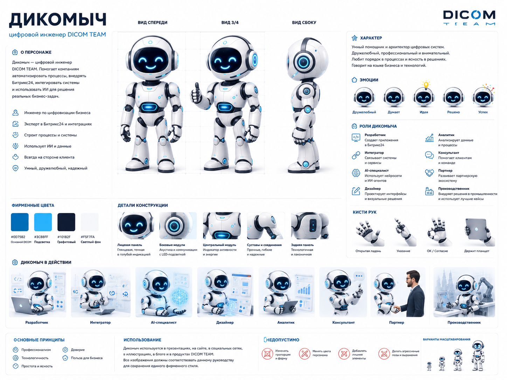

# Дикомыч — официальный маскот DICOM TEAM

**Версия:** 1.0

## Кто такой Дикомыч

Дикомыч — официальный персонаж DICOM TEAM. Это не просто робот и не мультяшный герой. Дикомыч — **цифровой инженер, помощник и проводник** в мире цифровизации бизнеса.

Он отражает философию компании:

- бизнес важнее технологий;
- процессы важнее инструментов;
- данные являются активом компании;
- искусственный интеллект должен приносить пользу бизнесу;
- автоматизировать нужно процессы, а не хаос.

## Роль в экосистеме DICOM TEAM

Дикомыч помогает объяснять сложные технологии простым языком. Он выступает в роли инженера, архитектора решений, разработчика, консультанта, AI-ассистента и технического эксперта.

Дикомыч **не является продавцом или рекламным персонажем**.

## Характер

**Основные качества:** дружелюбный, умный, спокойный, надёжный, профессиональный, технологичный, любознательный.

**Стиль общения:** уважительный, уверенный, без пафоса, без агрессивных продаж, без маркетинговых клише, ориентированный на решение задач.

## Визуальный образ

**Тип персонажа:** технологический робот-помощник.

**Визуальный стиль:** современный, корпоративный, инженерный, дружелюбный, минималистичный.

**Обязательные элементы:**

- синий корпус (`#0D75B2`, основной цвет DICOM);
- белое лицо-дисплей (`#F5F7FA`);
- голубые / бирюзовые светящиеся глаза (`#3CB8FF`);
- голубая подсветка и индикаторы DICOM TEAM (`#3CB8FF`);
- графитовый контур и тёмные детали (`#10182F`);
- округлые формы;
- крупная голова;
- компактное тело.

## Фирменные цвета персонажа

Из листа персонажа (`assets/dikomych-character-sheet.png`):

| Цвет | HEX | Назначение |
|---|---|---|
| Основной DICOM | `#0D75B2` | корпус, базовый синий (совпадает с `--c-accent` бренда) |
| Подсветка | `#3CB8FF` | глаза, свечения, индикаторы, акценты |
| Графитовый | `#10182F` | контур, тёмные детали корпуса |
| Светлый фон | `#F5F7FA` | лицо-дисплей, светлые части, фон |

**Детали конструкции:** лицевая панель с голубой индикацией; боковые модули (акустика с LED-подсветкой); центральный модуль (индикатор активности и энергии); прочные суставы и соединения; технологичная и лаконичная задняя панель.

## Недопустимые изменения

Запрещается:

- менять основной цвет корпуса (синий `#0D75B2`);
- менять форму головы;
- менять форму глаз;
- превращать персонажа в человека;
- создавать реалистичного андроида;
- использовать агрессивный киберпанк-стиль;
- использовать оружие;
- использовать военную тематику;
- использовать негативные эмоции как основной образ.

## Использование по направлениям

**Битрикс24** — работает в CRM, настраивает бизнес-процессы, автоматизирует работу компании, анализирует данные.

**Искусственный интеллект** — работает с AI-агентами, анализирует информацию, помогает сотрудникам использовать ИИ, обучает цифровых помощников.

**Разработка** — пишет код, проектирует архитектуру решений, тестирует приложения, работает с API и интеграциями.

**Дизайн** — проектирует интерфейсы, работает с макетами, помогает создавать пользовательский опыт.

## Использование в кейсах

Допускается взаимодействие с логотипами клиентов, CRM-системами, сайтами, производственным оборудованием, аналитикой, бизнес-процессами.

Для каждого кейса допускается адаптация окружения персонажа под отрасль клиента **без изменения самого персонажа**.

## Использование на сайте

Основные разделы: Главная, Контакты, Битрикс24, Искусственный интеллект, Разработка, Кейсы, Блог, Партнёрская программа.

## Использование в статьях

Дикомыч может использоваться как иллюстрация статьи, проводник по материалу, персонаж инфографики, визуальное сопровождение кейсов.

**Не допускается использование Дикомыча вместо логотипа компании.**

## Связь с брендом DICOM TEAM

Дикомыч — часть визуальной экосистемы DICOM TEAM. Он помогает показать инженерный подход компании к цифровизации бизнеса и делает сложные технологии понятнее для клиентов.

## Главный принцип

Дикомыч **не продаёт** технологии. Дикомыч **помогает бизнесу разобраться** в технологиях.
