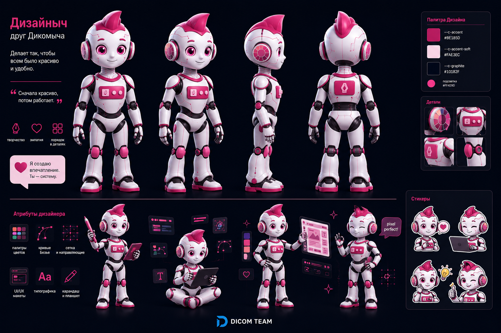

# Дизайныч — маскот направления «Дизайн»

**Версия:** 1.0 · Друг Дикомыча.

## Кто это

Дизайныч — сестринский персонаж Дикомыча, маскот направления **Дизайн** в DICOM TEAM. Если Дикомыч про инженерию и системы, то Дизайныч про красоту и удобство: интерфейсы, макеты, пользовательский опыт.

- Девиз: «Делает так, чтобы всем было красиво и удобно».
- Принцип: «Сначала красиво, потом работает».
- Реплика в паре с Дикомычем: «Я создаю впечатления. Ты — систему».

Характер: творческий, дружелюбный, внимательный к деталям, эмпатичный. Как и Дикомыч — не продавец.

## Фирменные цвета

| Роль | HEX | Назначение |
|---|---|---|
| Акцент (Дизайн) | `#BE185D` | корпусные акценты, гребень (= `--c-dir-design`) |
| Акцент-soft | `#FAE3EC` | мягкие подложки (= `--c-dir-design-soft`) |
| Подсветка | `#FF4D90` | глаза, свечения, индикаторы |
| Графит | `#10182F` | контур, суставы, тёмные детали |
| Корпус | `#F5F7FA` | белый/светлый основной материал |

Корпус **бело-розовый**: белый материал + бургунди-роуз акценты. Это цвет направления «Дизайн» — Дизайныч и есть его лицо.

## Обязательные элементы

Бело-розовый корпус · белое лицо-дисплей · розовые/маджента светящиеся глаза (`#FF4D90`) · характерный гребень-«ирокез» цвета `#BE185D` · графитовые суставы и контур · округлые формы · крупная голова · компактное тело.

## Запрещено

Менять цветовую схему (бело-бургунди) · менять форму головы, гребня или глаз · превращать в человека · реалистичный андроид · агрессивный киберпанк · оружие · военная тематика · негативные эмоции как основной образ · **использовать вместо логотипа**.

## Роль и атрибуты

Дизайн-направление: проектирует интерфейсы, работает с макетами, UX, типографикой, фирменным стилем. Атрибуты на листе: палитра цветов, кривые Безье, сетка с направляющими, UI-макеты, типографика, планшет и стилус.

## Пара с Дикомычем

Дикомыч (синий, инженер) + Дизайныч (бургунди, дизайнер) — официальная пара. Совместная сцена: `../assets/scenes/dikomych-and-dizainych.png` («Разработай дизайн UI!»). Используются вместе на материалах про связку «дизайн + разработка».

## Ассеты

- `assets/character-sheet.png` — лист персонажа (виды, палитра, эмоции, атрибуты, стикеры)
- `assets/parts/` — head, torso, leg (детальные рендеры)
- общая сцена пары — `../assets/scenes/dikomych-and-dizainych.png`

## Главный принцип

Дизайныч не продаёт. Дизайныч делает продукт понятным и приятным для людей.
